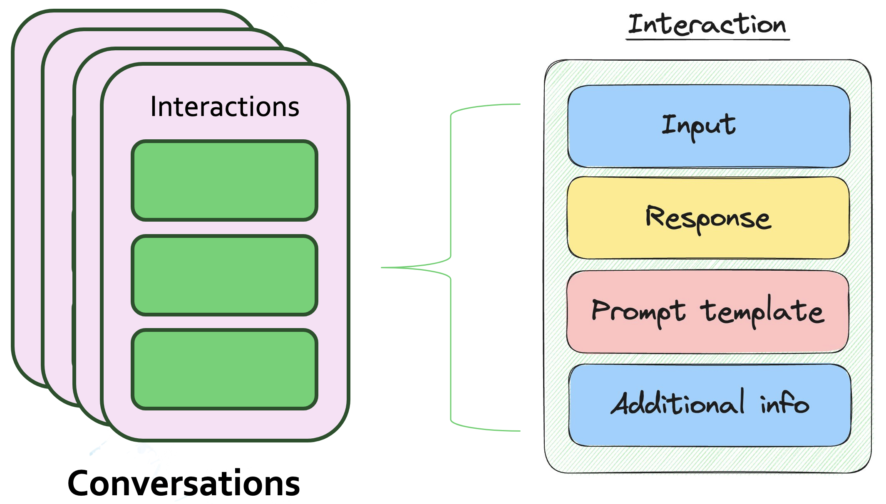

# Get started

## Why use Conversation Memory?

Large language models (LLMs) are popular for their ability to respond with natural language. However, because they are stateless, they do not "remember" previous user interactions. 

For instance, if you tell a language model “My name is Henry” in one inference, and then ask in another inference, “What’s my name?”, it cannot know, because all it knows about is the question you just asked. The LLM might guess by picking the most common name “Maria” or maybe it will simply say it doesn’t know. To build a chat application, the LLM clearly needs a way to reference the history of the conversation. 

Aryn added Conversation Memory to OpenSearch v2.10, and it makes it easy for LLMs access conversation history and add interactions to a conversation. For enterprise-grade use cases that require scalability, persistent conversations that a user can refer back to, or multi-agent LLM applications, you need a single, persistent source of conversation history.

Conversation memory also makes it easy to debug and tune your LLM applications by saving the prompt and response from the LLM. When tuning and debugging an LLM-based app, this is critical information - as the exact wording of a prompt can grealty effect the response. Most generative AI applications will involve some aspect of prompt-engineering, so this component is a critical part of the generative AI stack.

## Conversation Memory Architecture

Conversation Memory is in the ml-commons plugin in OpenSearch. It is a CRUD API built for storing conversations and adding new interactions. It uses a pair of OpenSearch system indices to store this data. We represent conversations as a list of interactions, where each interaction consists of an “input and a “response.” We also add two other fields to interactions and conversations to enable adding the prompt template used in the interaction and additional info specified by the application.





```javascript
structure ConversationMetadata {
    conversationId: ConversationId
    create_time: Timestamp
    name: String
}
```

```javascript
structure Interaction {
    conversation_id: ConversationId
    interaction_id: InteractionId
    input: String
    prompt_template: String
    response: String
    origin: String
    create_time: Timestamp
    additional_info: String
}
```

For details on the APIs please refer to the [API Spec](api-spec.md) or the official OpenSearch [documentation](https://opensearch.org/docs/2.10/ml-commons-plugin/conversational-search/) on conversational search.
