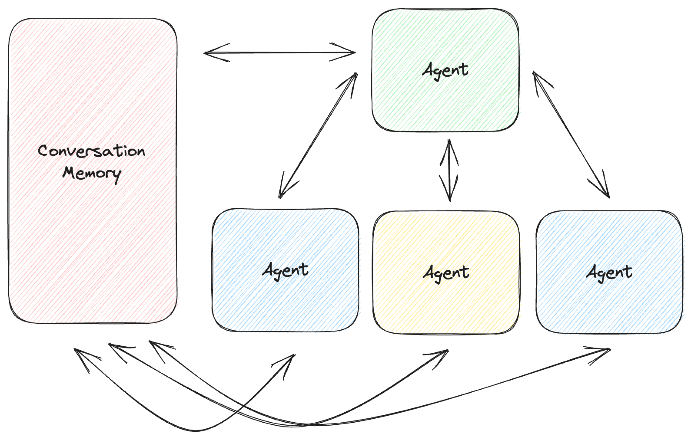

# Storage for Generative AI Agents

Developers use generative AI models to do all sorts of tasks, and can combine these models through a technique called Chain-of-Thought (CoT) reasoning. Instead of asking an LLM to solve a problem, you tell it what tools it has at its disposal and ask it to walk through the steps it would take to solve the problem. This LLM can communicate with other generative AI models, called Agents, to carry out these specific tasks. In this way, you can break down complicated tasks into specific tasks, with each task type carried out by a specific agent.

With multi-agent applications that are driven by natural language requests, it is essential to have a single source of truth for the conversation history. Multiple agents should be able to read the history of the same conversation, know where each interaction came from, and add their interactions in the CoT pipeline. Not only does this allow an agent to use the context of previous interactions, but also to reference the logic and authority of other agents involved in the conversation.

Additionally, conversation history should be persistent. End users might want to reference and pick up conversation threads, or tune and debug CoT pipelines through examining the interactions. Furthermore, developers should easily be able to secure conversations across different users and agents.

We have exposed conversation memory in OpenSearch as a standalone API, so that it can act as a single source of truth for multi-agent applications, and as easy persistent storage for all generative AI applications. It also uses OpenSearch's fine-grained access control to secure conversation data. For an example on how to use conversation memory to store state for a multi-agent application, visit: [Langchain Integration](../tutorials/using-aryn-with-langchain.md)
