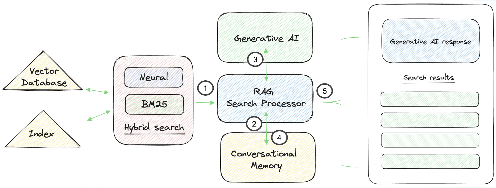

# Using Retrieval-Augmented Generation (RAG) pipelines

[Retrieval-augmented generation (RAG)](https://arxiv.org/abs/2005.11401) is a popular method to generate natural language answers to questions using LLMs and indexed data. It retreives relevant data to a query, and then sends it along with a prompt to a LLM to sythensize an answer. Sycamore implements RAG using an [OpenSearch Search Pipeline](https://opensearch.org/docs/latest/search-plugins/search-pipelines/index/
)

First, the stack uses a OpenSearch Search Pipeline to orchestrate interactions with LLMs using retrieval-augmented generation (RAG) pipelines. 

https://arxiv.org/abs/2005.11401

https://opensearch.org/docs/latest/search-plugins/search-pipelines/index/

Aryn added the Retrieval Augmented Generation Search Processor to OpenSearch v2.10 for conversational search. This is a response processor, meaning that it executes after the OpenSearch search process. 





The diagram above showes the flow of the RAG Search Processor.

1. The results from a hybrid search query are retrieved as the search context
2. The previous interactions from conversational memory are retrieved as conversation context
3. The processor constructs a prompt for an LLM using the search context, conversational context, and prompt template. It sends this to the LLM and gets a response
4. The response is added to the question and additional metadata, and saved in conversational memory as an interaction
5. The generative response and list of hybrid search results are returned to the application

If a conversation ID wasn't supplied (see [here](../conversational-memory/using-with-conversational-search.md)), then the processor will not retrieve the conversational context or add an interactoin to conversational memory.

To create a RAG pipeline, you must first have a remote LLM-wrapper deployed in ml-commons. Then, for example, to create a RAG pipeline called `rag_pipeline` using OpenAI GPT-3.5-Turbo,

```javascript
PUT /_search/pipeline/rag_pipeline
{
  "description": "Retrieval Augmented Generation Pipeline",
  "response_processors": [
    {
      "retrieval_augmented_generation": {
        "tag": "openai_pipeline_demo",
        "model_id": "<remote_model_id>",
        "context_field_list": [
          "text_representation"
        ],
        "llm_model": "gpt-3.5-turbo"
      }
    }
  ]
}
```

To use this processor, simply add this to your OpenSearch query 

```javascript
GET <index_name>/_search
{
  "query": {
    "neural": {
      "embedding": {
        "query_text": "Who wrote the book of love",
        "model_id": "<embedding model id>",
        "k": 100
      }
    }
  },
  "ext": {
    "generative_qa_parameters": {
      "llm_question": "Who wrote the book of love?"
    }
  }
}
```

The resulting LLM answer is in `response.ext` 
